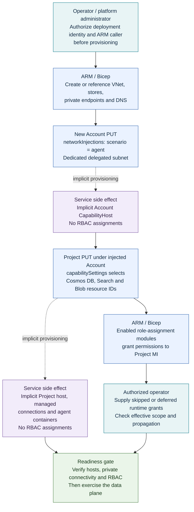
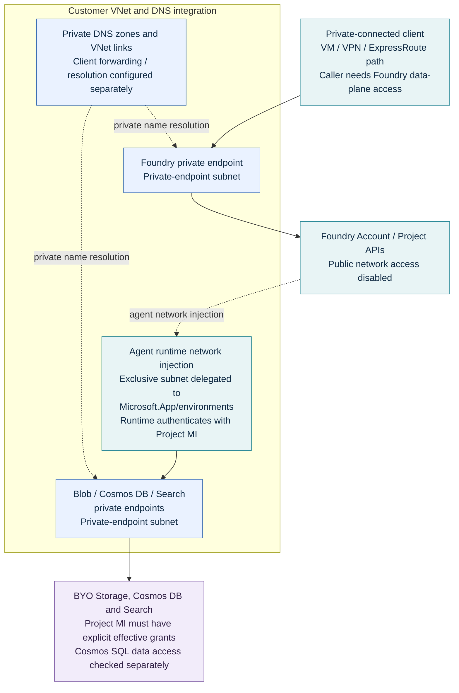

# Scenario 22 diagrams

These editable Mermaid diagrams describe the current [main entry point](../main.bicep). GitHub renders the diagrams directly; no generated PNG is required. The copied Scenario 15 layer images are not used because Scenario 22 has no explicit CapabilityHost deployment modules.

**Invariant: the service provisions no RBAC.** A service-created host, connection, database, or container is not a role assignment. The deployment identity creates enabled Bicep role resources; an authorized operator supplies caller permissions and any missing/deferred Project MI grants.

## 1. Provisioning and permission responsibilities

This is the **logical validation flow for a new account**, not a Bicep dependency graph. In particular, Project MI role modules consume Project outputs; placing them earlier in a source file would not make them authorize the preceding Project PUT. There is no explicit host resource for a role module to wait on.

**Reading the diagram**

- Teal: administrator/operator responsibilities. Blue: explicit ARM/Bicep writes. Purple: implicit service-side resource provisioning, **never role assignment**. Green: independent validation.
- Dashed arrows identify implicit side effects, not explicit host modules. Solid arrows express logical prerequisites, not exact ARM scheduling guarantees.
- Network injection is required. `capabilitySettings` supplies the backing-store IDs; it is not sufficient by itself to trigger the supported implicit-host flow.
- The main template defaults `assignContainerRoles=false`: the role box includes only enabled modules, and the operator must supply missing grants. The other entry points have different switches; consult the [RBAC matrix](../README.md#which-rbac-resources-the-templates-create).
- An existing-account deployment starts with an already network-injected, ready account/host. It does not perform the account network-injection PUT shown above.

**Source anchors:** [network and account modules](../main.bicep), [Account PUT](../modules-network-secured/ai-account-identity.bicep#L27-L57), [Project PUT and identity outputs](../modules-network-secured/ai-project-identity.bicep), [Storage assignment](../modules-network-secured/azure-storage-account-role-assignment.bicep), [Cosmos SQL assignment](../modules-network-secured/cosmos-container-role-assignments.bicep).

## 2. Private-network access and runtime identity

This separates inbound access to Foundry from the agent runtime's access to the BYO data stores. A private endpoint supplies connectivity, not authorization.

**Scope and omissions**

- The client connection, VPN/ExpressRoute, and DNS forwarding configuration are prerequisites, not resources created by these templates.
- The account and injection VNet must use the appropriate same-region configuration. Each new account requires its own delegated agent subnet; do not infer that shared backing stores permit sharing that subnet.
- The diagram shows logical endpoints; BYO stores can reside in different resource groups/subscriptions, subject to tenant, connectivity, and authorization requirements.
- `createDependentResourcePrivateEndpoints=false` reuses approved/reachable existing backing-store endpoints; it does not create new connectivity or RBAC.
- Optional ACR and monitoring resources are omitted for clarity. Their [registry module](../modules-network-secured/container-registry.bicep) and [tracing/AMPLS modules](../modules-network-secured/monitor-private-link-scope.bicep) add their own endpoints. The ACR module creates the Project MI's AcrPull grant explicitly.
- This is not a diagram of tool traffic. For private tools use [Scenario 19](../../19-private-network-agent-tools/).

**Source anchors:** [VNet/subnets](../modules-network-secured/vnet.bicep), [account injection](../modules-network-secured/ai-account-identity.bicep#L38-L56), [private endpoints and DNS](../modules-network-secured/private-endpoint-and-dns.bicep), [backing-resource configuration](../modules-network-secured/standard-dependent-resources.bicep), [Project MI permission scopes](../README.md#which-rbac-resources-the-templates-create).